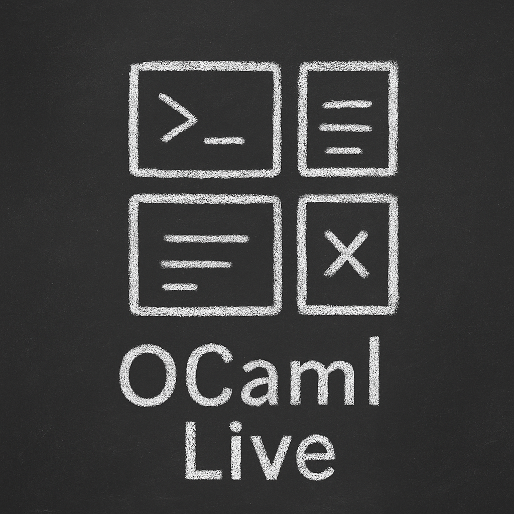
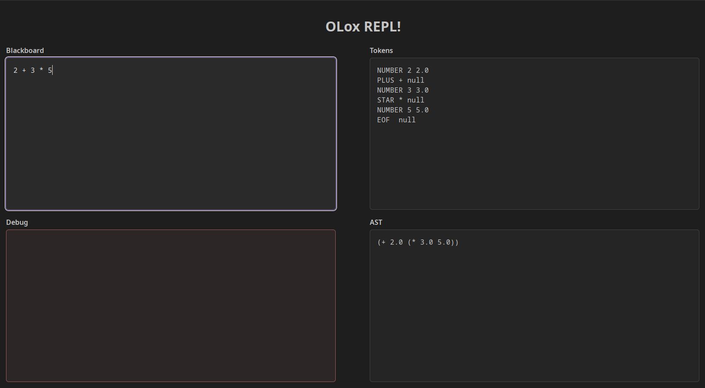

# An Interactive Coding Toy in OCaml



Project Name: TBD — For now, just “OCaml HTTP Server”!

The idea is to have some fun with OCaml, and since I want to build something interactive, why not create a small server
that serves a page with three panels? The user can enter code in one panel, and the other two will be used to display
output and any errors.

For now, our OCaml server can serve a basic *index.html* page and handle a simple transformation of input text using
ROT13 🙂... Everything is wired up — now it's just a matter of improving and expanding it!

Next steps: we'll follow the [Crafting Interpreters](https://craftinginterpreters.com/) book to parse and evaluate Lox
code from the input panel.

# Tricks

- To get doc in my terminal I'm using: `w3m "$(odig cache path)/html/index.html"`
  - of course you need to have `odig` installed...
- To run the server: `dune exec http_server`
- And for testing:
```bash
❯ curl http://localhost:8000/jOe
Hello jOe!
```
- But to truly immerse yourself in the experience open it in your browser 🤸


